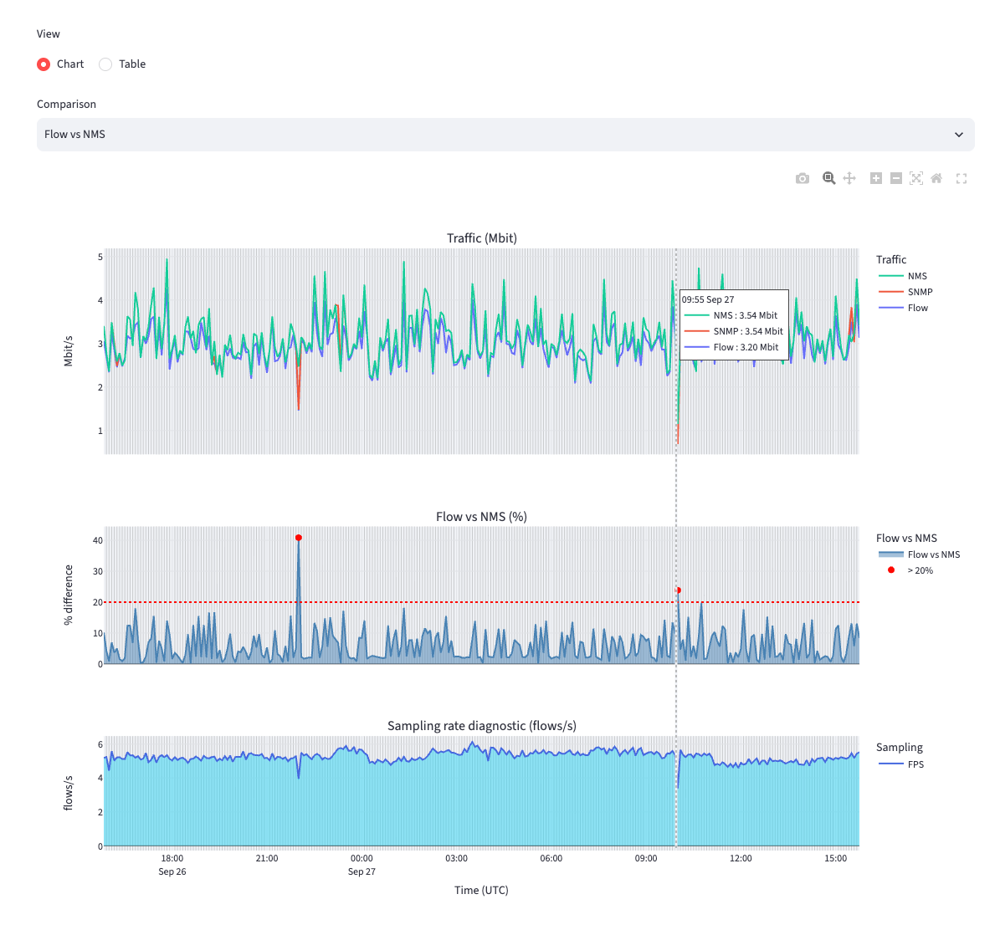
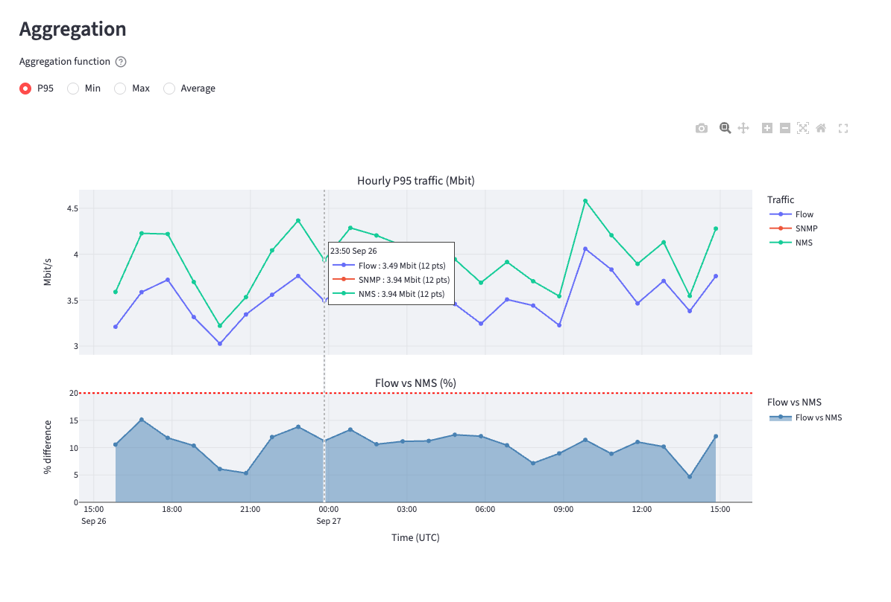

# flow-vs-snmp

A small, locally run diagnostic tool that compares **flow-derived bit rates** for one router
interface against **SNMP** for the same interface, over the last 24 hours, using the
[Kentik](https://www.kentik.com/) Query API.

Flow-derived traffic is *expected* to disagree with SNMP: flow is sampled, and Kentik may
downsample further at ingest. This app doesn't treat that gap as a bug. It measures it, at
every 5-minute datapoint, so you can see how large it is, when it happens, and whether it's
consistent.




## What it shows

For a device ID and interface index (ifindex), ingress direction, the app fetches three
independent time series at 5-minute resolution:

| Series | Source |
| --- | --- |
| **Flow** | Data Explorer, flow bits/s filtered to the interface |
| **SNMP** | Data Explorer, SNMP interface counters |
| **NMS** | Metrics Explorer (NMS), the same counter read through a second path |

It then shows:

- **Traffic chart**: all three series on one axis.
- **Delta chart**: per-datapoint difference for one selected pair (Flow vs SNMP, Flow vs NMS,
  or SNMP vs NMS). The delta is `|a − b| / max(a, b) × 100`, and points above 20% are
  highlighted. SNMP vs NMS acts as a data-quality control, since both read the same counter.
- **Sampling-rate diagnostic**: flows/s plus the applied sample rates. A rate that varies
  through the day suggests Kentik's ingest downsampling was active.
- **Timestamp offset detection**: some devices return SNMP stamped one bucket (5 min) late
  relative to flow. The app detects this and offers an opt-in shift. The data is never
  corrected silently.
- **Aggregation**: 24 hourly rollups (P95, Min, Max or Average) of the same data, with the
  matching delta.
- **Table view** of every datapoint, and the raw request/response JSON for each Kentik query,
  with a link to open the same query in the Kentik portal.

Sources degrade independently. If SNMP or NMS is unavailable (for example, a device not
monitored by NMS), the app still renders what it has and shows a warning.

## Quick start (Docker)

```sh
docker run --rm -p 8501:8501 ghcr.io/becos76/flow-vs-snmp:latest
```

Open <http://localhost:8501>. Then:

1. In the sidebar, enter your Kentik **email**, **API token** and **cluster** (US or EU).
2. Enter a **device ID** and **interface index**, then click **Analyze**.

To keep per-query request/response captures (the sidebar's **Save files** option), mount a
directory for them:

```sh
docker run --rm -p 8501:8501 -v "$PWD/outputs:/srv/outputs" ghcr.io/becos76/flow-vs-snmp:latest
```

Captures are written as
`outputs/{UTC stamp}-{device}-{ifindex}-{request|response}-{source}.json`. They contain
query bodies and Kentik responses, never credentials. They do contain your network's
traffic data, so treat them accordingly.

## Credentials and privacy

- You type your email and API token each session. They're held only in the Streamlit
  session's memory: never written to disk, never logged, never echoed in error messages.
- Auth travels only in request headers to Kentik's API, never in query bodies.
- Streamlit's anonymous usage telemetry is disabled (`.streamlit/config.toml`).
- The app serves plain HTTP. It's intended for `localhost`. If you expose it beyond your
  machine, put it behind HTTPS.

## Running locally without Docker

Requires Python 3.13.

```sh
python -m venv .venv
source .venv/bin/activate
pip install -r requirements-dev.txt
streamlit run app/app.py
```

## Development

```sh
pytest          # tests
ruff check .    # lint
```

The test fixtures in `tests/fixtures/` are **synthetic**. They reproduce the shape of real
Kentik responses and the quirks the app handles (the NMS series offset by two buckets,
SNMP/NMS outliers, scalar-only sample-rate rows), without any real network data. Regenerate
them with `python tests/fixtures/generate.py`.

The Kentik request payloads in `app/kentik/templates/` are real Data Explorer / Metrics
Explorer queries used **verbatim**. Only the device, interface, lookback and bucket fields
are substituted at runtime, because the Data Explorer schema is large and undocumented, and
hand-built minimal payloads tend to be rejected.

Design notes, conventions and the reasoning behind them are in [`CLAUDE.md`](CLAUDE.md).

## Releases

Releases are cut by pushing a version tag:

```sh
git tag v0.0.1
git push origin v0.0.1
```

The **Release** workflow then runs lint and tests, builds a multi-arch image
(`linux/amd64`, `linux/arm64`), pushes it to `ghcr.io/<owner>/flow-vs-snmp` as `0.0.1`,
`0.0` and `latest`, and creates a GitHub Release with generated notes. **CI** runs lint,
tests and a Docker build plus health check on every push and pull request.

## Disclaimer

This is an independent project. It is not affiliated with, endorsed by, or supported by
Kentik. "Kentik" is a trademark of its owner. Use of the Kentik API is subject to your own
Kentik account's terms.

## License

[MIT](LICENSE)
